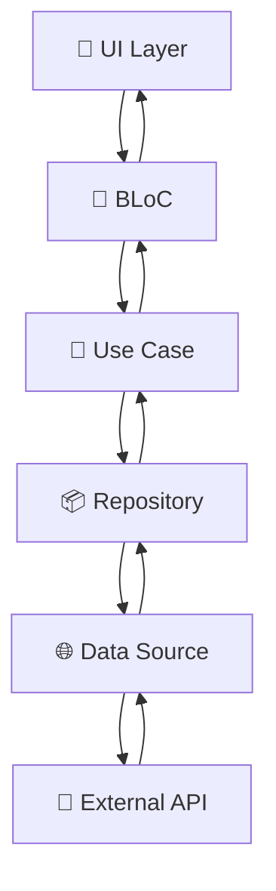

# 🤖 AI-Ready Architecture Guide - Flutter Clean Architecture + BLoC

> **Para Claude, Cursor AI e outros assistentes de código**  
> Este documento fornece instruções detalhadas para implementar features seguindo a arquitetura estabelecida neste projeto.

## 📋 Índice

- [🏗️ Visão Geral da Arquitetura](#️-visão-geral-da-arquitetura)
- [📁 Estrutura de Pastas](#-estrutura-de-pastas)
- [🎯 Guia Step-by-Step: Criando uma Nova Feature](#-guia-step-by-step-criando-uma-nova-feature)
- [🧩 Padrões e Convenções](#-padrões-e-convenções)
- [⚠️ Pontos Críticos e Boas Práticas](#️-pontos-críticos-e-boas-práticas)
- [🔧 Templates de Código](#-templates-de-código)
- [🧪 Testing Strategy](#-testing-strategy)
- [📚 Referência Técnica](#-referência-técnica)

---

## 🏗️ Visão Geral da Arquitetura

Este projeto implementa **Clean Architecture** de Robert C. Martin com **BLoC Pattern** para gerenciamento de estado. A arquitetura segue os princípios SOLID e garante:

- ✅ **Testabilidade**: Cada camada pode ser testada independentemente
- ✅ **Escalabilidade**: Novas features seguem estrutura consistente  
- ✅ **Manutenibilidade**: Separação clara de responsabilidades
- ✅ **Flexibilidade**: Fácil troca de implementações

### 🔄 Fluxo de Dados



### 🏛️ Camadas da Arquitetura

```
📱 Presentation Layer (UI + State Management)
   ├── 🎨 Pages & Widgets
   ├── 🔄 BLoC (Events, States, Blocs)
   └── 🎭 UI Logic

🧠 Domain Layer (Business Logic - Core)
   ├── 🏢 Entities (Business Objects)
   ├── 🎯 Use Cases (Business Rules)
   ├── 📋 DTOs (Data Transfer Objects)
   ├── 🔒 Repository Interfaces
   └── ✅ Validators (Domain Rules)

💾 Data Layer (Data Access & Implementation)
   ├── 🗃️ Models (Data Representations)
   ├── 🌐 Data Sources (API, Local Storage)
   └── 📦 Repository Implementations

🔧 Infrastructure Layer (External Concerns)
   ├── 🌐 HTTP Clients
   ├── 🔄 Interceptors
   ├── 💾 Cache Implementations
   └── 🔧 External Services
```

---

## 📁 Estrutura de Pastas

### 🎯 Estrutura Base para Features

```
lib/src/app/features/{feature_name}/
├── 🧠 domain/
│   ├── 🏢 entities/               # Objetos de negócio puros
│   │   ├── {entity}_entity.dart
│   │   └── {response}_entity.dart
│   ├── 📋 dtos/                   # Data Transfer Objects
│   │   ├── {action}_params.dart
│   │   └── {filter}_params.dart
│   ├── 🔒 repositories/           # Contratos/Interfaces
│   │   └── i_{feature}_repository.dart
│   ├── 🎯 usecases/               # Casos de uso específicos
│   │   ├── {action}_usecase.dart
│   │   └── {query}_usecase.dart
│   └── ✅ validators/             # Validações de domínio
│       └── {dto}_validators.dart
├── 💾 data/
│   ├── 🗃️ models/                 # Models que estendem entities
│   │   ├── {entity}_model.dart
│   │   └── {response}_model.dart
│   ├── 🌐 datasources/            # Fontes de dados
│   │   ├── {feature}_remote_datasource.dart
│   │   └── {feature}_local_datasource.dart
│   └── 📦 repositories/           # Implementações concretas
│       └── {feature}_repository_impl.dart
├── 🔧 infrastructure/             # Infraestrutura específica
│   ├── 🔄 {feature}_interceptor.dart
│   └── 🔧 {feature}_service.dart
└── 📱 presentation/
    ├── 🔄 bloc/                   # Gerenciamento de estado
    │   ├── {feature}_bloc.dart
    │   ├── {feature}_event.dart
    │   └── {feature}_state.dart
    ├── 🎨 pages/                  # Páginas da aplicação
    │   ├── {page}_page.dart
    │   └── {detail}_page.dart
    └── 🧩 widgets/                # Componentes reutilizáveis
        ├── {component}_widget.dart
        └── {custom}_widget.dart
```

### 📋 Exemplo Prático - Feature Auth

```
lib/src/app/features/auth/
├── domain/
│   ├── entities/
│   │   ├── user_entity.dart           # 👤 Usuário do sistema
│   │   └── auth_response_entity.dart  # 🔐 Resposta de autenticação
│   ├── dtos/
│   │   └── login_params.dart          # 📝 Parâmetros de login
│   ├── repositories/
│   │   └── i_auth_repository.dart     # 🔒 Contrato do repositório
│   ├── usecases/
│   │   └── login_usecase.dart         # 🎯 Caso de uso de login
│   └── validators/
│       └── login_params_validators.dart # ✅ Validações de login
├── data/
│   ├── models/
│   │   ├── user_model.dart            # 🗃️ Model do usuário
│   │   └── auth_response_model.dart   # 🗃️ Model da resposta
│   ├── datasources/
│   │   └── auth_remote_datasource.dart # 🌐 Fonte de dados remota
│   └── repositories/
│       └── auth_repository_impl.dart   # 📦 Implementação do repositório
├── infrastructure/
│   └── auth_interceptor.dart          # 🔄 Interceptador de autenticação
└── presentation/
    ├── bloc/
    │   ├── auth_bloc.dart             # 🔄 BLoC principal
    │   ├── auth_event.dart            # 📨 Eventos de autenticação
    │   └── auth_state.dart            # 📊 Estados de autenticação
    ├── pages/
    │   └── login_page.dart            # 🎨 Página de login
    └── widgets/                       # 🧩 (vazio - widgets específicos)
```

---

## 🎯 Guia Step-by-Step: Criando uma Nova Feature

> **🤖 Para AIs: Siga este processo exato para criar features consistentes**

### 🎬 Passo 0: Análise e Planejamento

```bash
# Antes de começar, analise:
# 1. Qual o domínio da feature? (ex: produtos, usuários, pedidos)
# 2. Quais operações serão necessárias? (CRUD, consultas específicas)
# 3. Que entidades estarão envolvidas?
# 4. Quais validações são necessárias?
# 5. Há integrações externas?
```

### 🏗️ Passo 1: Criar Estrutura de Pastas

```bash
# Crie a estrutura base da feature
lib/src/app/features/{feature_name}/
├── domain/
│   ├── entities/
│   ├── dtos/
│   ├── repositories/
│   ├── usecases/
│   └── validators/
├── data/
│   ├── models/
│   ├── datasources/
│   └── repositories/
├── infrastructure/
└── presentation/
    ├── bloc/
    ├── pages/
    └── widgets/
```

### 🧠 Passo 2: Domain Layer (Núcleo do Sistema)

#### 2.1 Criar Entities

```dart
// lib/src/app/features/{feature}/domain/entities/{entity}_entity.dart

/// 🏢 Entidade principal do domínio - DEVE ser imutável
final class {Entity}Entity {
  final String id;
  final String name;
  final DateTime createdAt;

  const {Entity}Entity({
    required this.id,
    required this.name,
    required this.createdAt,
  });

  // ✅ Implementar copyWith para imutabilidade
  {Entity}Entity copyWith({
    String? id,
    String? name,
    DateTime? createdAt,
  }) {
    return {Entity}Entity(
      id: id ?? this.id,
      name: name ?? this.name,
      createdAt: createdAt ?? this.createdAt,
    );
  }

  // ✅ Implementar Equatable se necessário
  @override
  bool operator ==(Object other) {
    if (identical(this, other)) return true;
    return other is {Entity}Entity &&
        other.id == id &&
        other.name == name &&
        other.createdAt == createdAt;
  }

  @override
  int get hashCode => Object.hash(id, name, createdAt);
}
```

#### 2.2 Criar DTOs

```dart
// lib/src/app/features/{feature}/domain/dtos/{action}_params.dart

/// 📋 DTO para transferência de dados - Pode ser mutável se necessário
final class {Action}Params {
  final String field1;
  final String field2;

  const {Action}Params({
    required this.field1,
    required this.field2,
  });

  // ✅ Factory method para instância vazia
  static {Action}Params empty() {
    return const {Action}Params(
      field1: '',
      field2: '',
    );
  }

  // ✅ Método de serialização para API
  Map<String, dynamic> toJson() {
    return {
      'field1': field1,
      'field2': field2,
    };
  }

  // ✅ CopyWith para atualizações imutáveis
  {Action}Params copyWith({
    String? field1,
    String? field2,
  }) {
    return {Action}Params(
      field1: field1 ?? this.field1,
      field2: field2 ?? this.field2,
    );
  }
}
```

#### 2.3 Criar Repository Interface

```dart
// lib/src/app/features/{feature}/domain/repositories/i_{feature}_repository.dart

import 'package:result_dart/result_dart.dart';
import '../entities/{entity}_entity.dart';
import '../dtos/{action}_params.dart';

/// 🔒 Contrato do repositório - Define operações disponíveis
abstract interface class I{Feature}Repository {
  // ✅ Use AsyncResult para tratamento funcional de erros
  AsyncResult<{Entity}Entity> create({Action}Params params);
  AsyncResult<{Entity}Entity> getById(String id);
  AsyncResult<List<{Entity}Entity>> getAll();
  AsyncResult<{Entity}Entity> update(String id, {Action}Params params);
  AsyncResult<void> delete(String id);
}
```

#### 2.4 Criar Use Cases

```dart
// lib/src/app/features/{feature}/domain/usecases/{action}_usecase.dart

import 'package:result_dart/result_dart.dart';
import '../../core/interfaces/usecase_interface.dart';
import '../entities/{entity}_entity.dart';
import '../dtos/{action}_params.dart';
import '../repositories/i_{feature}_repository.dart';

/// 🎯 Caso de uso específico - Encapsula regra de negócio
final class {Action}Usecase implements UseCase<{Entity}Entity, {Action}Params> {
  final I{Feature}Repository _{feature}Repository;

  const {Action}Usecase({
    required I{Feature}Repository {feature}Repository,
  }) : _{feature}Repository = {feature}Repository;

  @override
  AsyncResult<{Entity}Entity> call({Action}Params params) async {
    // ✅ Adicione regras de negócio específicas aqui se necessário
    // Ex: validações adicionais, transformações, etc.
    
    return await _{feature}Repository.create(params);
  }
}
```

#### 2.5 Criar Validators

```dart
// lib/src/app/features/{feature}/domain/validators/{params}_validators.dart

import 'package:lucid_validation/lucid_validation.dart';
import '../dtos/{action}_params.dart';

/// ✅ Validador usando LucidValidator
final class {Action}ParamsValidators extends LucidValidator<{Action}Params> {
  {Action}ParamsValidators() {
    ruleFor((params) => params.field1, key: 'field1')
        .notEmpty(message: 'Campo obrigatório')
        .minLength(3, message: 'Mínimo 3 caracteres');

    ruleFor((params) => params.field2, key: 'field2')
        .notEmpty(message: 'Campo obrigatório')
        .validEmail(message: 'Email inválido'); // se for email
  }
}
```

### 💾 Passo 3: Data Layer (Implementação e Persistência)

#### 3.1 Criar Models

```dart
// lib/src/app/features/{feature}/data/models/{entity}_model.dart

import 'dart:convert';
import '../../domain/entities/{entity}_entity.dart';

/// 🗃️ Model que estende Entity - Adiciona capacidades de serialização
final class {Entity}Model extends {Entity}Entity {
  const {Entity}Model({
    required super.id,
    required super.name,
    required super.createdAt,
  });

  // ✅ Factory para criar a partir de Map (JSON)
  factory {Entity}Model.fromMap(Map<String, dynamic> map) {
    try {
      return {Entity}Model(
        id: map['id'] as String,
        name: map['name'] as String,
        createdAt: DateTime.parse(map['created_at'] as String),
      );
    } catch (e, stackTrace) {
      throw Exception(
        'Error parsing {Entity}Model: $e\nStack trace: $stackTrace'
      );
    }
  }

  // ✅ Converter para Map (JSON)
  Map<String, dynamic> toMap() {
    return {
      'id': id,
      'name': name,
      'created_at': createdAt.toIso8601String(),
    };
  }

  // ✅ Métodos de conveniência para JSON
  factory {Entity}Model.fromJson(String source) =>
      {Entity}Model.fromMap(json.decode(source) as Map<String, dynamic>);

  String toJson() => json.encode(toMap());
}
```

#### 3.2 Criar DataSources

```dart
// lib/src/app/features/{feature}/data/datasources/{feature}_remote_datasource.dart

import '../../core/client_http/rest_client_interface.dart';
import '../../core/client_http/rest_client_request.dart';
import '../../core/client_http/rest_client_response.dart';
import '../../domain/dtos/{action}_params.dart';

/// 🌐 Fonte de dados remota - Responsável apenas por comunicação HTTP
final class {Feature}RemoteDatasource {
  final IRestClient _restClient;

  const {Feature}RemoteDatasource({
    required IRestClient restClient,
  }) : _restClient = restClient;

  // ✅ Use configuração para URLs, não hardcode
  static const String _baseEndpoint = '/api/{feature}';

  Future<RestClientResponse> create({Action}Params params) async {
    return await _restClient.post(
      RestClientRequest(
        path: _baseEndpoint,
        data: params.toJson(),
      ),
    );
  }

  Future<RestClientResponse> getById(String id) async {
    return await _restClient.get(
      RestClientRequest(
        path: '$_baseEndpoint/$id',
      ),
    );
  }

  Future<RestClientResponse> getAll() async {
    return await _restClient.get(
      RestClientRequest(
        path: _baseEndpoint,
      ),
    );
  }

  Future<RestClientResponse> update(String id, {Action}Params params) async {
    return await _restClient.put(
      RestClientRequest(
        path: '$_baseEndpoint/$id',
        data: params.toJson(),
      ),
    );
  }

  Future<RestClientResponse> delete(String id) async {
    return await _restClient.delete(
      RestClientRequest(
        path: '$_baseEndpoint/$id',
      ),
    );
  }
}
```

#### 3.3 Criar Repository Implementation

```dart
// lib/src/app/features/{feature}/data/repositories/{feature}_repository_impl.dart

import 'package:result_dart/result_dart.dart';
import '../../core/client_http/rest_client_exception.dart';
import '../../core/errors/errors.dart';
import '../../domain/entities/{entity}_entity.dart';
import '../../domain/dtos/{action}_params.dart';
import '../../domain/repositories/i_{feature}_repository.dart';
import '../models/{entity}_model.dart';
import '../datasources/{feature}_remote_datasource.dart';

/// 📦 Implementação concreta do repositório
final class {Feature}RepositoryImpl implements I{Feature}Repository {
  final {Feature}RemoteDatasource _{feature}RemoteDatasource;

  const {Feature}RepositoryImpl({
    required {Feature}RemoteDatasource {feature}RemoteDatasource,
  }) : _{feature}RemoteDatasource = {feature}RemoteDatasource;

  @override
  AsyncResult<{Entity}Entity> create({Action}Params params) async {
    try {
      final response = await _{feature}RemoteDatasource.create(params);
      final {entity} = {Entity}Model.fromMap(response.data as Map<String, dynamic>);
      return Success({entity});
    } on RestClientException catch (e) {
      return Failure(_mapHttpError(e));
    } catch (e) {
      return Failure(DefaultException(message: 'Erro inesperado: $e'));
    }
  }

  @override
  AsyncResult<{Entity}Entity> getById(String id) async {
    try {
      final response = await _{feature}RemoteDatasource.getById(id);
      final {entity} = {Entity}Model.fromMap(response.data as Map<String, dynamic>);
      return Success({entity});
    } on RestClientException catch (e) {
      return Failure(_mapHttpError(e));
    } catch (e) {
      return Failure(DefaultException(message: 'Erro inesperado: $e'));
    }
  }

  @override
  AsyncResult<List<{Entity}Entity>> getAll() async {
    try {
      final response = await _{feature}RemoteDatasource.getAll();
      final List<dynamic> data = response.data as List<dynamic>;
      final entities = data
          .map((item) => {Entity}Model.fromMap(item as Map<String, dynamic>))
          .toList();
      return Success(entities);
    } on RestClientException catch (e) {
      return Failure(_mapHttpError(e));
    } catch (e) {
      return Failure(DefaultException(message: 'Erro inesperado: $e'));
    }
  }

  @override
  AsyncResult<{Entity}Entity> update(String id, {Action}Params params) async {
    try {
      final response = await _{feature}RemoteDatasource.update(id, params);
      final {entity} = {Entity}Model.fromMap(response.data as Map<String, dynamic>);
      return Success({entity});
    } on RestClientException catch (e) {
      return Failure(_mapHttpError(e));
    } catch (e) {
      return Failure(DefaultException(message: 'Erro inesperado: $e'));
    }
  }

  @override
  AsyncResult<void> delete(String id) async {
    try {
      await _{feature}RemoteDatasource.delete(id);
      return const Success(null);
    } on RestClientException catch (e) {
      return Failure(_mapHttpError(e));
    } catch (e) {
      return Failure(DefaultException(message: 'Erro inesperado: $e'));
    }
  }

  // ✅ Mapeamento consistente de erros HTTP para domain exceptions
  BaseException _mapHttpError(RestClientException e) {
    switch (e.statusCode) {
      case 400:
        return DefaultException(message: 'Dados inválidos: ${e.message}');
      case 401:
        return UnauthorizedException(message: 'Não autorizado: ${e.message}');
      case 404:
        return NotFoundException(message: 'Recurso não encontrado: ${e.message}');
      case 500:
        return ServerException(message: 'Erro interno do servidor: ${e.message}');
      default:
        return DefaultException(message: 'Erro de rede: ${e.message}');
    }
  }
}
```

### 📱 Passo 4: Presentation Layer (UI e Estado)

#### 4.1 Criar Events

```dart
// lib/src/app/features/{feature}/presentation/bloc/{feature}_event.dart

part of '{feature}_bloc.dart';

/// 📨 Eventos do BLoC - Ações que podem ser disparadas
abstract class {Feature}Event extends Equatable {
  const {Feature}Event();

  @override
  List<Object?> get props => [];
}

final class {Feature}CreateRequested extends {Feature}Event {
  final {Action}Params params;

  const {Feature}CreateRequested({required this.params});

  @override
  List<Object> get props => [params];
}

final class {Feature}LoadRequested extends {Feature}Event {
  const {Feature}LoadRequested();
}

final class {Feature}LoadByIdRequested extends {Feature}Event {
  final String id;

  const {Feature}LoadByIdRequested({required this.id});

  @override
  List<Object> get props => [id];
}

final class {Feature}UpdateRequested extends {Feature}Event {
  final String id;
  final {Action}Params params;

  const {Feature}UpdateRequested({
    required this.id,
    required this.params,
  });

  @override
  List<Object> get props => [id, params];
}

final class {Feature}DeleteRequested extends {Feature}Event {
  final String id;

  const {Feature}DeleteRequested({required this.id});

  @override
  List<Object> get props => [id];
}
```

#### 4.2 Criar States

```dart
// lib/src/app/features/{feature}/presentation/bloc/{feature}_state.dart

part of '{feature}_bloc.dart';

/// 📊 Estados do BLoC - Representam diferentes estados da UI
abstract class {Feature}State extends Equatable {
  const {Feature}State();

  @override
  List<Object?> get props => [];
}

// ✅ Estado inicial
final class {Feature}Initial extends {Feature}State {
  const {Feature}Initial();
}

// ✅ Estado de carregamento
final class {Feature}Loading extends {Feature}State {
  const {Feature}Loading();
}

// ✅ Estado de lista carregada
final class {Feature}LoadSuccess extends {Feature}State {
  final List<{Entity}Entity> entities;

  const {Feature}LoadSuccess({required this.entities});

  @override
  List<Object> get props => [entities];
}

// ✅ Estado de item específico carregado
final class {Feature}LoadByIdSuccess extends {Feature}State {
  final {Entity}Entity entity;

  const {Feature}LoadByIdSuccess({required this.entity});

  @override
  List<Object> get props => [entity];
}

// ✅ Estado de criação bem-sucedida
final class {Feature}CreateSuccess extends {Feature}State {
  final {Entity}Entity entity;

  const {Feature}CreateSuccess({required this.entity});

  @override
  List<Object> get props => [entity];
}

// ✅ Estado de atualização bem-sucedida
final class {Feature}UpdateSuccess extends {Feature}State {
  final {Entity}Entity entity;

  const {Feature}UpdateSuccess({required this.entity});

  @override
  List<Object> get props => [entity];
}

// ✅ Estado de exclusão bem-sucedida
final class {Feature}DeleteSuccess extends {Feature}State {
  const {Feature}DeleteSuccess();
}

// ✅ Estado de erro
final class {Feature}Failure extends {Feature}State {
  final BaseException exception;

  const {Feature}Failure({required this.exception});

  @override
  List<Object> get props => [exception];
}
```

#### 4.3 Criar BLoC

```dart
// lib/src/app/features/{feature}/presentation/bloc/{feature}_bloc.dart

import 'package:equatable/equatable.dart';
import 'package:flutter_bloc/flutter_bloc.dart';
import 'package:result_dart/result_dart.dart';

import '../../core/errors/base_exception.dart';
import '../../domain/entities/{entity}_entity.dart';
import '../../domain/dtos/{action}_params.dart';
import '../../domain/usecases/{action}_usecase.dart';
import '../../domain/validators/{action}_params_validators.dart';

part '{feature}_event.dart';
part '{feature}_state.dart';

/// 🔄 BLoC principal da feature - Gerencia estado e eventos
final class {Feature}Bloc extends Bloc<{Feature}Event, {Feature}State> {
  final {Action}Usecase _{action}Usecase;
  // ✅ Adicione outros use cases conforme necessário

  {Feature}Bloc({
    required {Action}Usecase {action}Usecase,
  })  : _{action}Usecase = {action}Usecase,
        super(const {Feature}Initial()) {
    
    // ✅ Handler para criação
    on<{Feature}CreateRequested>(_onCreateRequested);
    
    // ✅ Adicione outros handlers conforme necessário
    // on<{Feature}LoadRequested>(_onLoadRequested);
    // on<{Feature}LoadByIdRequested>(_onLoadByIdRequested);
    // on<{Feature}UpdateRequested>(_onUpdateRequested);
    // on<{Feature}DeleteRequested>(_onDeleteRequested);
  }

  Future<void> _onCreateRequested(
    {Feature}CreateRequested event,
    Emitter<{Feature}State> emit,
  ) async {
    emit(const {Feature}Loading());

    final validator = {Action}ParamsValidators();

    final newState = await validator
        .validateResult(event.params)
        .flatMap(_{action}Usecase.call)
        .fold(
          ({entity}) => {Feature}CreateSuccess(entity: {entity}),
          (exception) => {Feature}Failure(exception: exception as BaseException),
        );

    emit(newState);
  }

  // ✅ Adicione outros handlers seguindo o mesmo padrão:
  /*
  Future<void> _onLoadRequested(
    {Feature}LoadRequested event,
    Emitter<{Feature}State> emit,
  ) async {
    emit(const {Feature}Loading());
    
    final result = await _getAllUsecase.call(NoParams());
    
    result.fold(
      (entities) => emit({Feature}LoadSuccess(entities: entities)),
      (exception) => emit({Feature}Failure(exception: exception as BaseException)),
    );
  }
  */
}
```

#### 4.4 Criar Page

```dart
// lib/src/app/features/{feature}/presentation/pages/{page}_page.dart

import 'package:flutter/material.dart';
import 'package:flutter_bloc/flutter_bloc.dart';

import '../../core/DI/dependency_injector.dart';
import '../../core/utils/show_snack_bar.dart';
import '../../domain/dtos/{action}_params.dart';
import '../../domain/validators/{action}_params_validators.dart';
import '../bloc/{feature}_bloc.dart';

/// 🎨 Página principal da feature
class {Page}Page extends StatefulWidget {
  const {Page}Page({super.key});

  @override
  State<{Page}Page> createState() => _{Page}PageState();
}

class _{Page}PageState extends State<{Page}Page> {
  final _formKey = GlobalKey<FormState>();
  final _validator = {Action}ParamsValidators();

  // ✅ Use o padrão estabelecido para forms
  {Action}Params _params = {Action}Params.empty();

  // ✅ Injection via service locator
  final _bloc = injector<{Feature}Bloc>();

  @override
  void dispose() {
    _params = {Action}Params.empty();
    _formKey.currentState?.reset();
    super.dispose();
  }

  void _submit() {
    if (_formKey.currentState?.validate() ?? false) {
      _bloc.add({Feature}CreateRequested(params: _params));
    }
  }

  @override
  Widget build(BuildContext context) {
    return Scaffold(
      appBar: AppBar(
        title: const Text('{Feature}'),
        centerTitle: true,
      ),
      body: BlocListener<{Feature}Bloc, {Feature}State>(
        bloc: _bloc,
        listener: (context, state) {
          // ✅ Handle success states
          if (state is {Feature}CreateSuccess) {
            showMessageSnackBar(
              context,
              'Criado com sucesso!',
              icon: Icons.check_circle,
              iconColor: Colors.green,
              textColor: Colors.white,
            );
          }
          
          // ✅ Handle error states
          if (state is {Feature}Failure) {
            showMessageSnackBar(
              context,
              state.exception.message,
              icon: Icons.error,
              iconColor: Colors.red,
              textColor: Colors.white,
            );
          }
        },
        child: Padding(
          padding: const EdgeInsets.all(16.0),
          child: Form(
            key: _formKey,
            child: Column(
              crossAxisAlignment: CrossAxisAlignment.stretch,
              children: [
                // ✅ Campo de exemplo
                TextFormField(
                  decoration: const InputDecoration(
                    labelText: 'Campo 1',
                    border: OutlineInputBorder(),
                  ),
                  validator: _validator.byField(_params, 'field1'),
                  onChanged: (value) {
                    setState(() {
                      _params = _params.copyWith(field1: value);
                    });
                  },
                  autovalidateMode: AutovalidateMode.onUserInteraction,
                ),
                
                const SizedBox(height: 16),
                
                // ✅ Botão com loading state
                BlocBuilder<{Feature}Bloc, {Feature}State>(
                  bloc: _bloc,
                  builder: (context, state) {
                    return ElevatedButton(
                      onPressed: state is {Feature}Loading ? null : _submit,
                      style: ElevatedButton.styleFrom(
                        padding: const EdgeInsets.symmetric(vertical: 16),
                        shape: RoundedRectangleBorder(
                          borderRadius: BorderRadius.circular(8),
                        ),
                      ),
                      child: state is {Feature}Loading
                          ? const SizedBox(
                              height: 20,
                              width: 20,
                              child: CircularProgressIndicator(strokeWidth: 2),
                            )
                          : const Text(
                              'Salvar',
                              style: TextStyle(fontSize: 16),
                            ),
                    );
                  },
                ),
              ],
            ),
          ),
        ),
      ),
    );
  }
}
```

### 🔧 Passo 5: Dependency Injection

```dart
// Adicionar no lib/src/core/DI/dependency_injector.dart

void setup{Feature}Dependencies() {
  // ✅ DataSource
  injector.registerLazySingleton<{Feature}RemoteDatasource>(
    () => {Feature}RemoteDatasource(
      restClient: injector<RestClientDioImpl>(),
    ),
  );

  // ✅ Repository
  injector.registerLazySingleton<I{Feature}Repository>(
    () => {Feature}RepositoryImpl(
      {feature}RemoteDatasource: injector<{Feature}RemoteDatasource>(),
    ),
  );

  // ✅ Use Cases
  injector.registerFactory<{Action}Usecase>(
    () => {Action}Usecase(
      {feature}Repository: injector<I{Feature}Repository>(),
    ),
  );

  // ✅ BLoC
  injector.registerLazySingleton<{Feature}Bloc>(
    () => {Feature}Bloc(
      {action}Usecase: injector<{Action}Usecase>(),
    ),
  );
}

// Chame na função principal de setup:
void setupDependencyInjector({bool loggerApi = false}) {
  // ... outras configurações
  
  setup{Feature}Dependencies(); // ✅ Adicione aqui
}
```

---

## 🧩 Padrões e Convenções

### 📝 Nomenclatura

| Tipo | Padrão | Exemplo |
|------|--------|---------|
| **Entities** | `{Name}Entity` | `UserEntity`, `ProductEntity` |
| **Models** | `{Name}Model` | `UserModel`, `ProductModel` |
| **DTOs** | `{Action}Params` | `LoginParams`, `CreateUserParams` |
| **Repository Interface** | `I{Feature}Repository` | `IAuthRepository`, `IProductRepository` |
| **Repository Impl** | `{Feature}RepositoryImpl` | `AuthRepositoryImpl` |
| **Use Cases** | `{Action}Usecase` | `LoginUsecase`, `CreateProductUsecase` |
| **Validators** | `{DTO}Validators` | `LoginParamsValidators` |
| **DataSources** | `{Feature}{Type}Datasource` | `AuthRemoteDatasource` |
| **BLoC Events** | `{Feature}{Action}Requested` | `AuthLoginRequested` |
| **BLoC States** | `{Feature}{Status}` | `AuthLoading`, `AuthLoginSuccess` |
| **Pages** | `{Page}Page` | `LoginPage`, `ProductListPage` |
| **Widgets** | `{Component}Widget` | `CustomButtonWidget` |

### 🎯 Convenções de Código

#### ✅ Use `final class` para Classes Não Extensíveis

```dart
// ✅ Correto
final class LoginParams { }
final class UserEntity { }

// ❌ Evite (a menos que precise de herança)
class LoginParams { }
```

#### ✅ Use `const` Sempre que Possível

```dart
// ✅ Correto
const UserEntity({
  required this.id,
  required this.name,
});

// Factory methods const
static const UserEntity empty = UserEntity(id: '', name: '');
```

#### ✅ Implementar `copyWith` em Entities e DTOs

```dart
UserEntity copyWith({
  String? id,
  String? name,
}) {
  return UserEntity(
    id: id ?? this.id,
    name: name ?? this.name,
  );
}
```

#### ✅ Use Result Pattern para Error Handling

```dart
// ✅ Correto
AsyncResult<UserEntity> getUser(String id);

// ❌ Evite throws diretos
Future<UserEntity> getUser(String id); // pode lançar exception
```

#### ✅ Validação com LucidValidator

```dart
ruleFor((params) => params.email, key: 'email')
    .notEmpty(message: 'Email obrigatório')
    .validEmail(message: 'Email inválido');
```

### 🔄 Fluxo de Estados no BLoC

```dart
// ✅ Padrão para todos os BLoCs
on<{Feature}{Action}Requested>((event, emit) async {
  emit(const {Feature}Loading());

  final validator = {DTO}Validators();

  final newState = await validator
      .validateResult(event.params)
      .flatMap(_usecase.call)
      .fold(
        (success) => {Feature}{Action}Success(data: success),
        (exception) => {Feature}Failure(exception: exception as BaseException),
      );

  emit(newState);
});
```

---

## ⚠️ Pontos Críticos e Boas Práticas

### 🚨 CRÍTICO: Dependency Rule

> **A regra de dependência deve SEMPRE ser respeitada**

```
📱 Presentation → 🧠 Domain ← 💾 Data ← 🔧 Infrastructure
```

- ✅ **Domain** não pode depender de nenhuma outra camada
- ✅ **Data** pode depender apenas de Domain
- ✅ **Presentation** pode depender apenas de Domain
- ✅ **Infrastructure** pode depender de Domain e Data

### 🚨 CRÍTICO: Imutabilidade

```dart
// ✅ Entities DEVEM ser imutáveis
final class UserEntity {
  final String id;
  final String name;
  
  const UserEntity({required this.id, required this.name});
}

// ❌ NUNCA faça isso
class UserEntity {
  String id;        // Mutável
  String name;      // Mutável
  
  void setName(String newName) { // Método mutante
    name = newName;
  }
}
```

### 🚨 CRÍTICO: Error Handling

```dart
// ✅ Use Result Pattern
AsyncResult<UserEntity> login(LoginParams params);

// ✅ Mapeie errors específicos
BaseException _mapHttpError(RestClientException e) {
  switch (e.statusCode) {
    case 401: return UnauthorizedException(message: e.message);
    case 404: return NotFoundException(message: e.message);
    default: return DefaultException(message: e.message);
  }
}

// ❌ NUNCA use throws diretos em repositories
Future<UserEntity> login(LoginParams params) {
  // ... código que pode dar throw
}
```

### 📋 Checklist de Boas Práticas

#### ✅ Domain Layer
- [ ] Entities são imutáveis (`final` fields)
- [ ] DTOs têm `copyWith` method
- [ ] Repository interfaces usam `AsyncResult`
- [ ] Use cases implementam `UseCase<Output, Input>`
- [ ] Validators estendem `LucidValidator`
- [ ] Zero dependências externas

#### ✅ Data Layer
- [ ] Models estendem Entities
- [ ] DataSources têm responsabilidade única
- [ ] Repository mapeia errors HTTP para domain
- [ ] Try-catch com stack trace detalhado
- [ ] URLs vêm de configuração (não hardcode)

#### ✅ Presentation Layer
- [ ] Estados implementam `Equatable`
- [ ] BLoC usa functional chaining (`flatMap`, `fold`)
- [ ] UI separa `BlocListener` (side effects) de `BlocBuilder` (rebuild)
- [ ] Forms usam validação em tempo real
- [ ] Loading states são tratados

#### ✅ Infrastructure Layer
- [ ] Interceptors implementam interface
- [ ] Configurações externalizadas
- [ ] Services têm responsabilidade única

### 🛡️ Princípios SOLID Aplicados

#### **S - Single Responsibility**
- Cada classe tem uma responsabilidade específica
- DataSources apenas fazem HTTP calls
- Validators apenas validam
- Use Cases apenas executam regras de negócio

#### **O - Open/Closed**
- Aberto para extensão via interfaces
- Fechado para modificação (use `final class`)

#### **L - Liskov Substitution**
- Models podem substituir Entities
- Implementações podem substituir interfaces

#### **I - Interface Segregation**
- Interfaces específicas e focadas
- Repository interfaces por feature

#### **D - Dependency Inversion**
- Camadas superiores dependem de abstrações
- Dependency injection via interfaces

---

## 🔧 Templates de Código

### 📋 Template: Entity

```dart
/// Template: Entity
final class {Entity}Entity {
  final String id;
  final String name;
  final DateTime createdAt;
  final DateTime updatedAt;

  const {Entity}Entity({
    required this.id,
    required this.name,
    required this.createdAt,
    required this.updatedAt,
  });

  {Entity}Entity copyWith({
    String? id,
    String? name,
    DateTime? createdAt,
    DateTime? updatedAt,
  }) {
    return {Entity}Entity(
      id: id ?? this.id,
      name: name ?? this.name,
      createdAt: createdAt ?? this.createdAt,
      updatedAt: updatedAt ?? this.updatedAt,
    );
  }

  @override
  bool operator ==(Object other) {
    if (identical(this, other)) return true;
    return other is {Entity}Entity &&
        other.id == id &&
        other.name == name &&
        other.createdAt == createdAt &&
        other.updatedAt == updatedAt;
  }

  @override
  int get hashCode => Object.hash(id, name, createdAt, updatedAt);

  @override
  String toString() {
    return '{Entity}Entity(id: $id, name: $name, createdAt: $createdAt, updatedAt: $updatedAt)';
  }
}
```

### 📋 Template: DTO

```dart
/// Template: DTO
final class {Action}Params {
  final String field1;
  final String field2;
  final int field3;

  const {Action}Params({
    required this.field1,
    required this.field2,
    required this.field3,
  });

  static {Action}Params empty() {
    return const {Action}Params(
      field1: '',
      field2: '',
      field3: 0,
    );
  }

  Map<String, dynamic> toJson() {
    return {
      'field1': field1,
      'field2': field2,
      'field3': field3,
    };
  }

  {Action}Params copyWith({
    String? field1,
    String? field2,
    int? field3,
  }) {
    return {Action}Params(
      field1: field1 ?? this.field1,
      field2: field2 ?? this.field2,
      field3: field3 ?? this.field3,
    );
  }

  @override
  bool operator ==(Object other) {
    if (identical(this, other)) return true;
    return other is {Action}Params &&
        other.field1 == field1 &&
        other.field2 == field2 &&
        other.field3 == field3;
  }

  @override
  int get hashCode => Object.hash(field1, field2, field3);

  @override
  String toString() {
    return '{Action}Params(field1: $field1, field2: $field2, field3: $field3)';
  }
}
```

### 📋 Template: Model

```dart
/// Template: Model
import 'dart:convert';
import '../../domain/entities/{entity}_entity.dart';

final class {Entity}Model extends {Entity}Entity {
  const {Entity}Model({
    required super.id,
    required super.name,
    required super.createdAt,
    required super.updatedAt,
  });

  factory {Entity}Model.fromMap(Map<String, dynamic> map) {
    try {
      return {Entity}Model(
        id: map['id'] as String,
        name: map['name'] as String,
        createdAt: DateTime.parse(map['created_at'] as String),
        updatedAt: DateTime.parse(map['updated_at'] as String),
      );
    } catch (e, stackTrace) {
      throw Exception(
        'Error parsing {Entity}Model: $e\nStack trace: $stackTrace'
      );
    }
  }

  Map<String, dynamic> toMap() {
    return {
      'id': id,
      'name': name,
      'created_at': createdAt.toIso8601String(),
      'updated_at': updatedAt.toIso8601String(),
    };
  }

  factory {Entity}Model.fromJson(String source) =>
      {Entity}Model.fromMap(json.decode(source) as Map<String, dynamic>);

  String toJson() => json.encode(toMap());

  @override
  String toString() {
    return '{Entity}Model(id: $id, name: $name, createdAt: $createdAt, updatedAt: $updatedAt)';
  }
}
```

---

## 🧪 Testing Strategy

### 🧩 Estrutura de Testes

```
test/
├── unit/
│   ├── domain/
│   │   ├── entities/
│   │   ├── usecases/
│   │   └── validators/
│   ├── data/
│   │   ├── models/
│   │   ├── datasources/
│   │   └── repositories/
│   └── presentation/
│       └── bloc/
├── integration/
│   └── {feature}/
└── widget/
    └── pages/
```

### 🧪 Template: Unit Test para UseCase

```dart
import 'package:flutter_test/flutter_test.dart';
import 'package:mocktail/mocktail.dart';
import 'package:result_dart/result_dart.dart';

// Mocks
class Mock{Feature}Repository extends Mock implements I{Feature}Repository {}

void main() {
  group('{Action}Usecase', () {
    late {Action}Usecase usecase;
    late Mock{Feature}Repository mockRepository;

    setUp(() {
      mockRepository = Mock{Feature}Repository();
      usecase = {Action}Usecase({feature}Repository: mockRepository);
    });

    test('should return {Entity}Entity when repository call succeeds', () async {
      // Arrange
      final params = {Action}Params.empty();
      final entity = {Entity}Entity(/* ... */);
      
      when(() => mockRepository.create(params))
          .thenAnswer((_) async => Success(entity));

      // Act
      final result = await usecase(params);

      // Assert
      expect(result.isSuccess(), isTrue);
      expect(result.getOrNull(), equals(entity));
      verify(() => mockRepository.create(params)).called(1);
    });

    test('should return Failure when repository call fails', () async {
      // Arrange
      final params = {Action}Params.empty();
      final exception = DefaultException(message: 'Error');
      
      when(() => mockRepository.create(params))
          .thenAnswer((_) async => Failure(exception));

      // Act
      final result = await usecase(params);

      // Assert
      expect(result.isError(), isTrue);
      expect(result.exceptionOrNull(), equals(exception));
      verify(() => mockRepository.create(params)).called(1);
    });
  });
}
```

### 🧪 Template: Unit Test para BLoC

```dart
import 'package:bloc_test/bloc_test.dart';
import 'package:flutter_test/flutter_test.dart';
import 'package:mocktail/mocktail.dart';
import 'package:result_dart/result_dart.dart';

// Mocks
class Mock{Action}Usecase extends Mock implements {Action}Usecase {}

void main() {
  group('{Feature}Bloc', () {
    late {Feature}Bloc bloc;
    late Mock{Action}Usecase mock{Action}Usecase;

    setUp(() {
      mock{Action}Usecase = Mock{Action}Usecase();
      bloc = {Feature}Bloc({action}Usecase: mock{Action}Usecase);
    });

    tearDown(() {
      bloc.close();
    });

    test('initial state is {Feature}Initial', () {
      expect(bloc.state, equals(const {Feature}Initial()));
    });

    blocTest<{Feature}Bloc, {Feature}State>(
      'emits [Loading, CreateSuccess] when {Feature}CreateRequested succeeds',
      build: () {
        final entity = {Entity}Entity(/* ... */);
        when(() => mock{Action}Usecase(any()))
            .thenAnswer((_) async => Success(entity));
        return bloc;
      },
      act: (bloc) => bloc.add({Feature}CreateRequested(params: {Action}Params.empty())),
      expect: () => [
        const {Feature}Loading(),
        isA<{Feature}CreateSuccess>(),
      ],
    );

    blocTest<{Feature}Bloc, {Feature}State>(
      'emits [Loading, Failure] when {Feature}CreateRequested fails',
      build: () {
        final exception = DefaultException(message: 'Error');
        when(() => mock{Action}Usecase(any()))
            .thenAnswer((_) async => Failure(exception));
        return bloc;
      },
      act: (bloc) => bloc.add({Feature}CreateRequested(params: {Action}Params.empty())),
      expect: () => [
        const {Feature}Loading(),
        isA<{Feature}Failure>(),
      ],
    );
  });
}
```

---

## 📚 Referência Técnica

### 🔗 Dependências Principais

```yaml
dependencies:
  # State Management
  flutter_bloc: ^9.1.1
  equatable: ^2.0.7
  
  # Dependency Injection
  get_it: ^8.0.3
  
  # HTTP Client
  dio: ^5.8.0+1
  
  # Error Handling
  result_dart: ^2.1.1
  
  # Validation
  lucid_validation: ^1.3.1
  
  # Local Storage
  shared_preferences: ^2.5.3

dev_dependencies:
  # Testing
  flutter_test:
    sdk: flutter
  bloc_test: ^9.1.1
  mocktail: ^1.0.4
```

### 📖 Conceitos Chave

#### 🎯 **UseCase Interface**
```dart
abstract interface class UseCase<Type, Params> {
  AsyncResult<Type> call(Params params);
}
```

#### 🔄 **Result Pattern**
```dart
// Success/Failure ao invés de try/catch
AsyncResult<T> operation() async {
  try {
    final result = await someOperation();
    return Success(result);
  } catch (e) {
    return Failure(SomeException(message: e.toString()));
  }
}
```

#### 🔗 **Functional Chaining**
```dart
final result = await validator
    .validateResult(params)     // AsyncResult<Params>
    .flatMap(usecase.call)      // AsyncResult<Entity>
    .fold(
      SuccessState.new,         // Entity -> SuccessState
      FailureState.new,         // Exception -> FailureState
    );
```

### 🎨 Patterns Utilizados

| Pattern | Uso | Localização |
|---------|-----|-------------|
| **Repository** | Abstração de dados | Domain/Data |
| **UseCase** | Regras de negócio | Domain |
| **Factory** | Criação de objetos | Models, DTOs |
| **BLoC** | Gerenciamento de estado | Presentation |
| **Dependency Injection** | Inversão de controle | Core/DI |
| **Result** | Error handling funcional | Todas as camadas |
| **Interceptor** | Middleware HTTP | Infrastructure |

### 🛠️ Comandos Úteis

```bash
# Criar nova feature (estrutura básica)
mkdir -p lib/src/app/features/{feature}/{domain,data,presentation,infrastructure}
mkdir -p lib/src/app/features/{feature}/domain/{entities,dtos,repositories,usecases,validators}
mkdir -p lib/src/app/features/{feature}/data/{models,datasources,repositories}
mkdir -p lib/src/app/features/{feature}/presentation/{bloc,pages,widgets}

# Gerar código (build_runner)
flutter packages pub run build_runner build

# Rodar testes
flutter test
flutter test --coverage

# Análise de código
flutter analyze
dart format lib/
```

---

## 🎉 Conclusão

Este guia fornece uma estrutura sólida e consistente para desenvolvimento de features em Flutter seguindo Clean Architecture + BLoC. 

### ✅ Benefícios desta Arquitetura

- **🧪 Testabilidade**: Cada camada pode ser testada independentemente
- **🔄 Manutenibilidade**: Código organizado e fácil de manter
- **📈 Escalabilidade**: Estrutura que cresce sem dor
- **🎯 Consistência**: Padrões claros para toda a equipe
- **🛡️ Robustez**: Error handling e validação em todas as camadas

### 🤖 Para Assistentes de IA

Siga este guia **rigorosamente** para garantir consistência. Sempre:

1. ✅ Respeite a **Dependency Rule**
2. ✅ Use **Result Pattern** para error handling
3. ✅ Implemente **validação** em todas as entradas
4. ✅ Mantenha **imutabilidade** nas entities
5. ✅ Siga os **templates** e **convenções** estabelecidos

---

> **📝 Nota**: Este documento é um living document. Atualize conforme a arquitetura evolui, mantendo sempre a consistência e as boas práticas estabelecidas.

**Versão**: 1.0  
**Última atualização**: 2025-01-19  
**Autor**: Análise da Feature Auth Existente